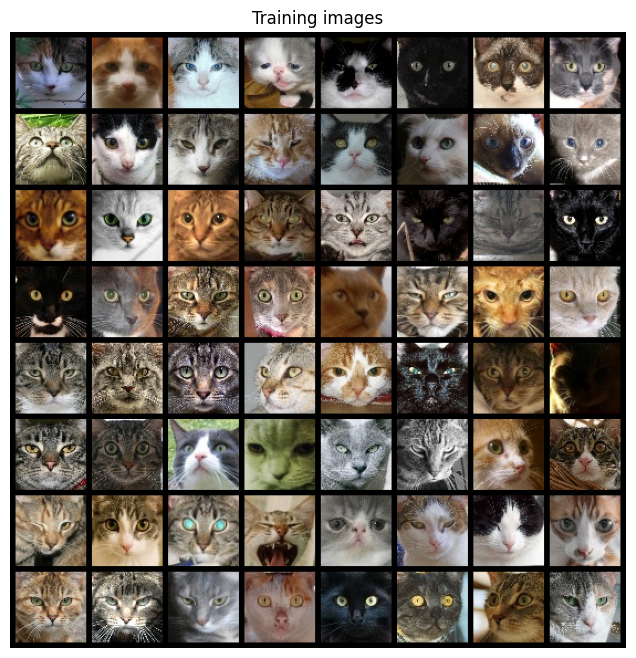
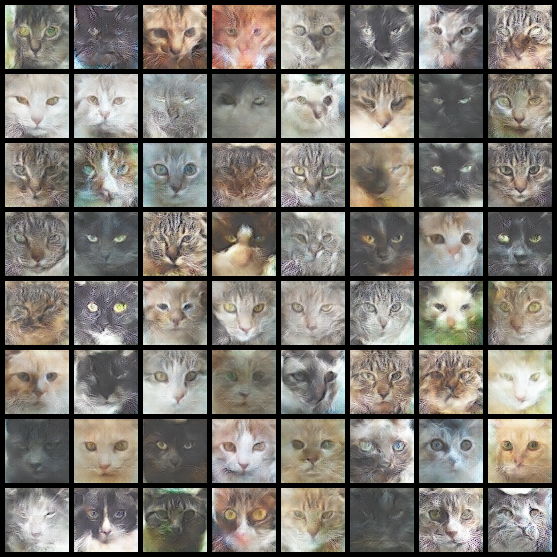

# Cat Generator With DCGANs

This project is a Cat Generator utilizing Deep Convolutional Generative Adversarial Networks (DCGANs). The purpose is to generate realistic images of cats (64x64) using generative modeling techniques.

## Overview

The `Cat-Generator-With-DCGANs` project involves the following components:

- **Generator**: A neural network responsible for generating synthetic images of cats.
- **Discriminator**: Another neural network tasked with distinguishing between real and generated images.
- **Training Loop**: The training loop where the Generator and Discriminator networks are trained adversarially.
- **Dataset Handling**: Handling and preprocessing the cat image dataset.
- **Visualization**: Displaying generated cat images during training and analyzing losses.

### Generator Architecture
```plaintext
----------------------------------------------------------------
        Layer (type)               Output Shape         Param #
================================================================
   ConvTranspose2d-1            [-1, 512, 4, 4]         819,200
       BatchNorm2d-2            [-1, 512, 4, 4]           1,024
              ReLU-3            [-1, 512, 4, 4]               0
   ConvTranspose2d-4            [-1, 256, 8, 8]       2,097,152
       BatchNorm2d-5            [-1, 256, 8, 8]             512
              ReLU-6            [-1, 256, 8, 8]               0
   ConvTranspose2d-7          [-1, 128, 16, 16]         524,288
       BatchNorm2d-8          [-1, 128, 16, 16]             256
              ReLU-9          [-1, 128, 16, 16]               0
  ConvTranspose2d-10           [-1, 64, 32, 32]         131,072
      BatchNorm2d-11           [-1, 64, 32, 32]             128
             ReLU-12           [-1, 64, 32, 32]               0
  ConvTranspose2d-13            [-1, 3, 64, 64]           3,072
             Tanh-14            [-1, 3, 64, 64]               0
================================================================
Total params: 3,576,704
Trainable params: 3,576,704
Non-trainable params: 0
----------------------------------------------------------------
Input size (MB): 0.00
Forward/backward pass size (MB): 3.00
Params size (MB): 13.64
Estimated Total Size (MB): 16.64
----------------------------------------------------------------
```

### Discriminator Architecture
```plaintext
----------------------------------------------------------------
        Layer (type)               Output Shape         Param #
================================================================
            Conv2d-1           [-1, 64, 32, 32]           3,072
         LeakyReLU-2           [-1, 64, 32, 32]               0
            Conv2d-3          [-1, 128, 16, 16]         131,072
       BatchNorm2d-4          [-1, 128, 16, 16]             256
         LeakyReLU-5          [-1, 128, 16, 16]               0
            Conv2d-6            [-1, 256, 8, 8]         524,288
       BatchNorm2d-7            [-1, 256, 8, 8]             512
         LeakyReLU-8            [-1, 256, 8, 8]               0
            Conv2d-9            [-1, 512, 4, 4]       2,097,152
      BatchNorm2d-10            [-1, 512, 4, 4]           1,024
        LeakyReLU-11            [-1, 512, 4, 4]               0
           Conv2d-12              [-1, 1, 1, 1]           8,192
          Sigmoid-13              [-1, 1, 1, 1]               0
================================================================
Total params: 2,765,568
Trainable params: 2,765,568
Non-trainable params: 0
----------------------------------------------------------------
Input size (MB): 0.05
Forward/backward pass size (MB): 2.31
Params size (MB): 10.55
Estimated Total Size (MB): 12.91
----------------------------------------------------------------
```


## Prerequisites

Ensure you have the following libraries installed:

- `torch`: PyTorch for building and training neural networks.
- `torchvision`: PyTorch's library for vision-related tasks.
- `pickle`: For serializing Python objects.

## Usage

1. **Download Dataset**: The project requires a dataset of cat images. You can download the dataset from
[Cat_Dataset_15k](https://drive.google.com/file/d/1zNWRIkelSD4BHMYtvxT0zbvJec4dGKnG/view?usp=sharing) and place it in the appropriate directory.

2. **Download required files**: This project needs some extra file to run analysis and visualizing action after training.
[Extra Files](https://drive.google.com/drive/folders/1rd1cZAw4sp9lXINUy7hQEgks5sO0SVlk?usp=sharing) and place it in the appropriate directory.

3. **Run the Notebook or .py files**: Execute the notebook `Cat Generator with DCGans.ipynb`. 
Ensure you have access to GPU for faster training, although CPU training is also supported.

4. **Training**: The notebook contains the training loop for both the Generator and Discriminator.
Adjust hyperparameters and training settings as needed.

5. **Post-Training Analysis**:
   - Save models (`gen1.pth` and `disc1.pth`) for future use.
   - Analyze losses and training progress (`loss_analysis.csv`).
   - Generate animation object to visualize the learning process.

6. **Visualization**:
   - View training images and generated cat images during training.
   - Visualize losses and training progress.

## Training Dataset

Here is an example of the training image used for training:



## Generated Images

Here is an example of a generated cat image trained after `20` epochs and `15k` images with a batch size of `64`:



## Acknowledgments

- The project utilizes Colab for easy access to GPU resources.
- Inspired by DCGANs and the idea of generative adversarial networks.
- The idea of `Generator` and `Discriminator` architecture is improvasion.
- The dataset is taken from `kaggle`.

## Author

- [Duc Phan]

